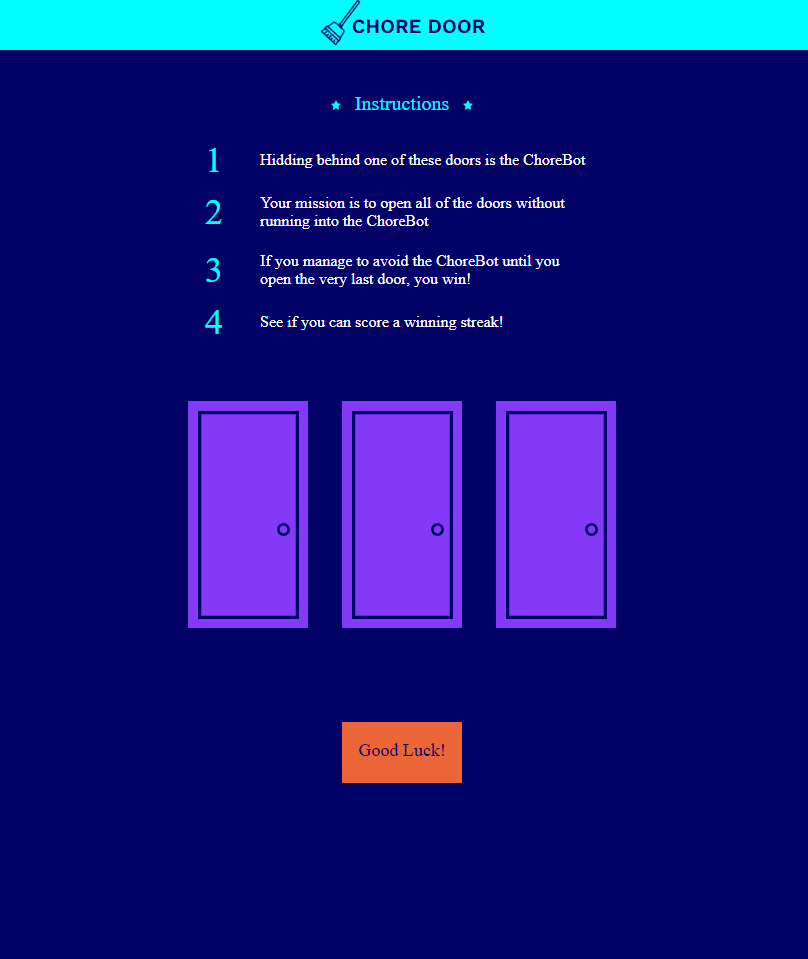

# Chore Door

Codecademy project to build a interactive website. 

The goal is to open all of the doors without running into ChoreBot. If you manage to avoid ChoreBot until you open the last door, you win!

## 🚀 Build with

- HTML
- CSS
- JavaScript

## 📸 Screenshot
 
 - Desktop version
 
